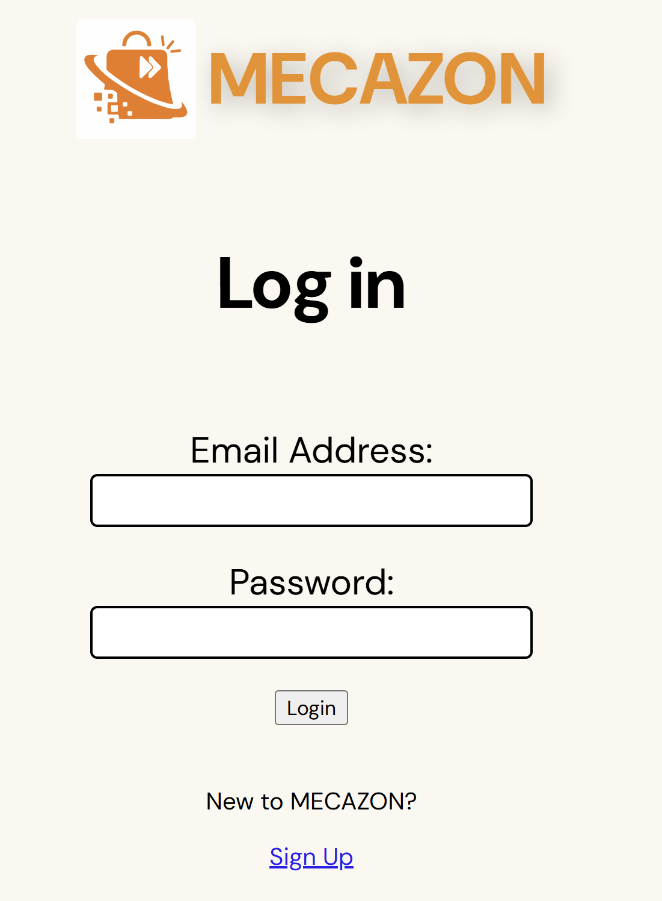
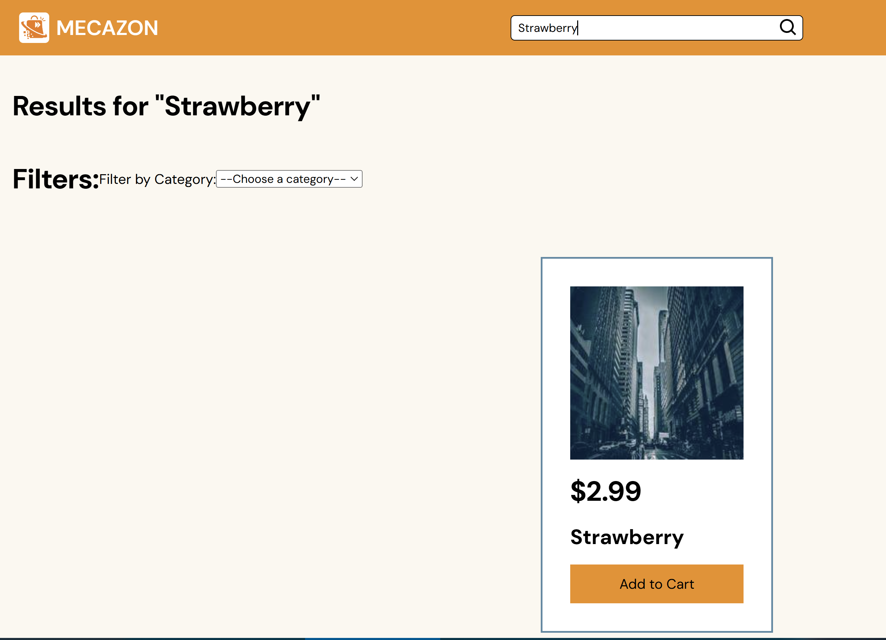

### Myles's Contribution to Team B's react code

Myles worked mostly on the login functionality of the site. On top of that, he also worked on getting the modal for each product to display properly.

## Login Contribution

# Login.jsx page

```js
import styles from "../styles/UserForms.module.css";
import { Link } from "react-router-dom";

export default function Login() {
  return (
    <div className={styles.Form}>
      <div className={styles.Brand}>
        {" "}
        MECAZON
      </div>
      <h1 className={styles.Header}>Log in</h1>
      <form action="">
        <label className={styles.Label} htmlFor="email">
          Email Address:
        </label>{" "}
        <br />
        <input
          className={styles.Input}
          type="email"
          id="email"
          name="email"
          required
        /> <br /> <br />
        <label className={styles.Label} htmlFor="password">
          Password:
        </label>{" "}
        <br />
        <input
          className={styles.Input}
          type="password"
          id="password"
          name="password"
          pattern=""
          required
        /> <br /> <br />
        <button type="submit">Login</button>
        <p className={styles.RegisterText}>New to MECAZON?</p>
        <Link to="/register">Sign Up</Link>
      </form>
    </div>
  );
}
```



# Signup.jsx page

```js
import styles from "../styles/UserForms.module.css";
import { Link } from "react-router-dom";

export default function Signup() {
  return (
    <div className={styles.Form}>
      <div className={styles.Brand}>
        {" "}
        MECAZON
      </div>
      <h1 className={styles.Header}>Sign Up</h1>
      <form action="">
        <label className={styles.Label} htmlFor="email">
          Email Address:
        </label>{" "}
        <br />
        <input
          className={styles.Input}
          type="email"
          id="email"
          name="email"
          required
        /> <br /> <br />
        <label className={styles.Label} htmlFor="password">
          Password:
        </label>{" "}
        <br />
        <input
          className={styles.Input}
          type="password"
          id="password"
          name="password"
          pattern=""
          required
        /> <br /> <br />
        <label className={styles.Label} htmlFor="confirmPassword">
          Confirm Password:
        </label>{" "}
        <br />
        <input
          className={styles.Input}
          type="text"
          id="confirmPassword"
          name="confirmPassword"
          pattern=""
          required
        /> <br /> <br />
        <button type="submit">Sign Up</button>
        <p className={styles.LoginText}>Existing account?</p>
        <Link to="/login">Sign in</Link>
      </form>
    </div>
  );
}
```

## Modal Contribution

# Modal.jsx component

```js
import styles from "../styles/Modal.module.css";
import addToCartFunc from "./AddToCartBtn";
import Carousel from "./Carousel";
import { useState, useEffect, useRef } from "react";
import axios from "axios";

export default function Modal({ data, setModalData }) {
  const [products, setProducts] = useState([]);
  const [isModalOpen, setModalStatus] = useState(false);
  const [quantity, setQuantity] = useState(0);
  const modalRef = useRef(null);
  const [reviewText, setReviewText] = useState("");
  const reviewRef = useRef(null);

  async function fetchProducts() {
    try {
      const response = await axios.get("/dummy-data/groceries.json");
      // console.log(response.data);
      setProducts(response.data);
    } catch (err) {
      console.error("something went wrong fetching products", err);
    }
  }

  useEffect(() => {
    fetchProducts();
  }, []);

  function closeModal() {
    modalRef.current.close();

    setModalStatus(false);
    setModalData({});
  }

  function handleReview(event) {
    setReviewText(event.target.value);
  }
  function addReview() {
    console.log(reviewText);
    setModalData((prevObject) =>
      prevObject.reviews
        ? { ...prevObject, reviews: [...prevObject.reviews, reviewText] }
        : { ...prevObject, reviews: [reviewText] }
    );
    setReviewText("");
    console.log(data);
  }

  useEffect(() => {
    setModalStatus(true);

    if (isModalOpen) {
      modalRef.current.showModal();
    }
  }, [data]);

  return (
    <dialog
      ref={modalRef}
      onKeyDown={(e) => {
        e.key === "Escape" ? closeModal() : null;
      }}
      className={styles.container}
    >
      <div className={styles.modalContent}>
        <div className={styles.row}>
          <div className={styles.imgDisplay}>
            
          </div>

          <div className={styles.itemInformation}>
            <h1>{data.name}</h1>
            <h2>About this item:</h2>

            <p>
              Lorem ipsum dolor sit amet consectetur adipisicing elit. Ducimus
              eius, laboriosam aperiam quis quibusdam facilis maiores quam fugit
              perspiciatis modi totam tempore soluta non quidem corrupti aut
              exercitationem, sapiente nisi.
            </p>

            <div className={styles.buttonSection}>
              <button
                onClick={() => {
                  for (let i = 0; i < quantity; i++) {
                    addToCartFunc(data);
                    closeModal();
                  }
                  alert(`${data.name} was added to your cart.`);
                }}
                className={styles.addCartButton}
              >
                Add to Cart
              </button>
              <div className={styles.quantitySelector}>
                <div>
                  <button
                    onClick={() => {
                      quantity > 0 ? setQuantity((prev) => (prev -= 1)) : null;
                    }}
                  >
                    -
                  </button>
                </div>

                <div>
                  <h2>{quantity}</h2>
                </div>

                <div>
                  <button
                    onClick={() => {
                      setQuantity((prev) => (prev += 1));
                    }}
                  >
                    +
                  </button>
                </div>
              </div>
            </div>
          </div>
        </div>

        <div className={styles.row}>
          <div className={styles.otherInfo}>
            <h1>⭐⭐⭐⭐⭐</h1>

            <div>
              <h2>Reviews</h2>
              <p>{data.reviews}</p>
              <textarea
                value={reviewText}
                ref={reviewRef}
                placeholder={"Type your review here"}
                onChange={handleReview}
              ></textarea>
              <p>Your review: {reviewText}</p>
              <button onClick={addReview}>Submit Review</button>
            </div>

            <h1>${data.price}</h1>
          </div>

          <div className={styles.suggestedProducts}>
            <h2>Suggested Products</h2>
            <Carousel setModalData={setModalData} count={3} data={products} />
          </div>
        </div>

        <button onClick={closeModal}>Close</button>
      </div>
    </dialog>
  );
}
```

## Search Bar Contribution

# SearchBar.jsx component

```js
import styles from "../styles/SearchBar.module.css";
import { useRef } from "react";
import { useNavigate } from "react-router-dom";

export default function Search({ setSearchValue }) {
  const inputRef = useRef(null);
  const navigate = useNavigate();

  function submitSearch(e) {
    if (e.key === "Enter" || e.type === "click") {
      setSearchValue(inputRef.current.value);
      navigate("/groceries");
    }
  }

  return (
    <div className={styles.searchWrapper}>
      <input
        ref={inputRef}
        onKeyDown={submitSearch}
        className={styles.searchInput}
        type="text"
        placeholder="Search"
      />

      
    </div>
  );
}
///~~~~~~~~~~~~~~~~~~~~~~~~~~~~~~~~
<div className={styles.col}>
  <Search setSearchValue={setSearchValue}></Search>
</div>;
```


